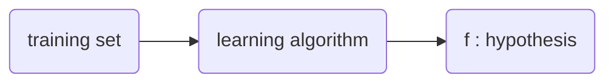

# 머신러닝이란? 
- `머신러닝 (machine learnig)` 
	Field of study that gives computers the ability to learn without being explicitly programmed.

## machine learning algorithms
1. `Supervised learning(지도 학습)`
2. `Unsupervised learning(비지도 학습)`
3. Recommender systems
4. `Reinforcement leaning(강화 학습)`

## Supervised learning
$$
X :\text{input} \rightarrow Y : \text{output label}  
$$
learns from being given *right answers*
	입력값에 대한 정답값이 정해져 있는 데이터를 통해 학습함으로써, 최종적으로 임의의 입력값에 대한 결과값을 추론, 예측함.

1. `Regression`
	Predict a number infinitely many possibe outputs
2. `Classification(class category)`
	predict categories small number of possible outputs
## Unsupervised learning
1. `clustering`
	Find some group (cluster) from given data
2. `Anomaly detection`
	Find unusual data points
3. `Dimensionality reduction`
	Compresss data using fewer numbers

# Regression Model

$$
\text{$x$ : input} \rightarrow \text{$f$ : model} \rightarrow \text{$\widehat{y}$ : predicted output }
$$

$$
f_{w,b}(x) = wx+b
$$
이를 `Linear regression`또는 `Univariate linear regression` 이라 한다. 
	just one input variable `x` (= with one single feature)

- `w`, `b` : parameters (= coefficients, weights )
## Cost Function
- `오차 (error)` : $y - \widehat{y}$
  
- Squared error cost function
$$
\begin{align}
J(w,b) &= \frac{1}{m}\Sigma_{i=1}^m (\widehat{y_{i}} - y_{i})^2 \\
&= \frac{1}{m}\Sigma_{i=1}^m (f_{w,b}(x_{i}) - y_{i})^2
\end{align}
$$

- `m` : number of training examples, 데이터의 수
- 최종 값의 편의를 위해 $\frac{1}{2}$ 를 곱하기도 함

> goal of linear regression is minimize $J(w,b)$ 


## Gradient Descent
- Outline
	1. Start with some $w, b$ ( usually set $w=0, b = 0$)
	2. Keep changing $w, b$ to reduce $J(w,b)$ until we settle at or near a minimum

> 최솟값은 두개 이상이 될 수 있음.
> 하지만, `Squared error cost function`을 사용할 경우, 최솟값은 오직 하나만을 가진다. 

### Gradient Descent algorithm
- $\alpha$ : Learning rate , $0 \leq \alpha \leq 1$ 


$$
\begin{align}
tmp\_w &= w-\alpha \frac{d}{dw}J(w,b) \\
tmp\_b &= b-\alpha \frac{d}{db}J(w,b)  \\
w &= tmp\_w  \\
b &= tmp\_b
\end{align}
$$

각 도함수는 다음과 같다.
$$
\begin{align}
\frac{d}{dw}J(w,b) &= \frac{d}{dw} \frac{1}{m} \Sigma_{i=1}^m (f_{w,b}(x^{(i)}) - y^{(i)})^2  \\
&= \frac{d}{dw} \frac{1}{m} \Sigma_{i=1}^m (wx^{(i)} + b - y^{(i)})^2  \\
&= \frac{1}{m}\Sigma_{i=1}^m (wx^{(i)} + b - y^{(i)}) \times 2x_{i}  \\
\end{align}
$$
기존 [[Andrew Ng, Course 1#Cost Function|Cost Function]] 에서 선택적으로 $\frac{1}{2}$를 곱하기도 했는데, 그 경우, 계산된 도함수 값은 다음과 같다.
$$
\begin{align}
&= \frac{1}{2} \frac{1}{m}\Sigma_{i=1}^m (wx^{(i)} + b - y^{(i)}) \times 2x^{(i)}  \\
&= \frac{1}{m}\Sigma_{i=1}^m (wx^{(i)} + b - y^{(i)})x^{(i)}  \\
&= \frac{1}{m}\Sigma_{i=1}^m (f_{w,b}(x^{(i)}) - y^{(i)})x^{(i)}
\end{align}
$$

$$
\begin{align}
\frac{d}{db}J(w,b) &= \frac{d}{db} \frac{1}{m} \Sigma_{i=1}^m(f_{w,b}(x) - y^{(i)})^2  \\
&= \frac{d}{db} \frac{1}{m} \Sigma_{i=1}^m(wx^{(i)} + b - y^{(i)})^2  \\
&= \frac{1}{m} \Sigma_{i=1}^m(wx^{(i)} + b - y^{(i)}) \times 2
\end{align}
$$

마찬가지로, 선택적으로 $\frac{1}{2}$를 곱한 경우, 최종 값은 다음과 같다.

$$
\begin{align}
&= \frac{1}{m} \Sigma_{i=1}^m(f_{w,b}(x^{(i)}) - y^{(i)})
\end{align}
$$


최종적으로 경사하강법 알고리즘 식은 다음과 같다.
$$
\begin{align}
&\text{repeat until convergence \{ } \\
&\ \ \ \ \ w = w - \alpha \frac{1}{m}\Sigma_{i=1}^m (f_{w,b}(x^{(i)}) - y^{(i)})x^{(i)}  \\
&\ \ \ \ \ b = b - \alpha \frac{1}{m} \Sigma_{i=1}^m(f_{w,b}(x^{(i)}) - y^{(i)}) \\
&\text{\} }
\end{align}
$$

#### Learning rate
- $\alpha$ is too small
	model's performance is better, but Gradient descent may be slow.
- $\alpha$ is too large
	Gradient descent is faster ,but may overshoot, never reach minimum

### Batch gradient descent 
- `Batch` : Each step of gradient descent uses all the training examples.

## Multiple linear regression
`multiple linear regression` has multiple feauters
- $x_{j}$ : $j^{th}$ feature
- $n$ : number of features
- $\vec{x}^{(i)}$ : features of $i^{th}$ training example 
	$\vec{x}^{(i)} = \{ x_{1}^{(i)}, x_{2}^{(i)}, \cdots , x_{n}^{(i)}\}$

> [[Andrew Ng, Course 1#Vectorization|벡터 참고 부록]]

### model 
$$
f_{\vec{w},b}(\vec{x}) = \vec{w} \cdot  \vec{x} + b = \Sigma_{i=1}^n(w_{i} \cdot x_{i}) + b
$$
### cost function
$$
\begin{align}
J(\vec{w}, b) &= J(w_{1},w_{2}, \cdots , w_{n}, b)  \\
&= \frac{1}{2m}\Sigma_{i=1}^m(f_{\vec{w},b}(x^{(i)}) - y^{(i)})^2 \\

\end{align}

$$
### gradient descent 
$$
\begin{align}
&\text{repeat \{ }  \\
&\ \ \ \ \ w_{j} = w_{j} - \alpha \frac{d}{dw_{j}}J(w_{1},w_{2}, \cdots, w_{n}, b) \\
&\ \ \ \ \ b = b - \alpha \frac{d}{db}J(w_{1},w_{2}, \cdots, w_{n}, b) \\
&\text{ \} }
\end{align}
$$
즉, 다음과 같다. 
$$
\begin{align}
&\text{repeat \{ }  \\
&\ \ \ \ \ w_{1} = w_{1} - \alpha \frac{1}{m} \Sigma_{i=1}^m(f_{\vec{w},b}(\vec{x}^{(i)}) - y^{(i)})x_{1}^{(i)}  \\
&\ \ \ \ \ \ \ \ \ \ \ \ \ \ \ \ \ \ \ \ \ \ \ \ \ \ \ \vdots  \\
&\ \ \ \ \ w_{n} = w_{n} - \alpha \frac{1}{m} \Sigma_{i=1}^m(f_{\vec{w},b}(\vec{x}^{(i)}) - y^{(i)})x_{n}^{(i)}  \\
&\ \ \ \ \ b = b - \alpha \frac{1}{m} \Sigma_{i=1}^m(f_{\vec{w},b}(\vec{x}^{(i)}) - y^{(i)}) \\
&\text{ \} }
\end{align}
$$

### Feature Scaling 
> 요약 : `features`의 범위(단위) 를 맞추는 것

|           | 변경 전            | 변경 후          |
| --------- | --------------- | ------------- |
| 집 평 수     | 10 ~ 60 ($m^2$) | 0~1 ($\in N$) |
| 침대 수      | 0 ~ 4 ($\in N$) | 0~1 ($\in N$) |
| 주변 역과의 거리 | 0 ~ 20 (km)     | 0~1 ($\in N$) |

#### method 1 : divide with max value 
$$
\begin{align*}
10 \leq \text{집 평수} \leq 60  \\
\vdots  \\
\frac{10}{60} \leq \text{집 평수}_{\text{scaled}} \leq \frac{60}{60} \\
0.166 \leq \text{집 평수}_{\text{scaled}} \leq 1
\end{align*}
$$
일반화하면, 다음과 같다.
$$
x_{\text{scaled}, i} = \frac{x_{i}}{\text{max}(\vec{x})}\ \ \ (x_{\text{scaled},i} \leq 1)
$$

#### method 2 : Mean normalization

$$
\begin{align*}
10 \leq \text{집 평수} \leq 60  \\
\text{집 평수}_{\text{scaled}} = \frac{\text{집 평수} - \mu_{\text{집 평수}}}{60 - 10}
\end{align*}
$$
일반화하면, 다음과 같다.
$$
x_{\text{scaled},i} = \frac{x_{i} - \mu_{i}}{\text{max}(x_{i}) - \text{min}(x_{i})}\ \ \ (-1 \leq x_{\text{scaled},i} \leq 1)
$$

#### method 3 : Z-score normalization
$$
\begin{align*}
10 \leq \text{집 평수} \leq 60  \\
\text{집 평수}_{\text{scaled}} = \frac{\text{집 평수} - \mu_{\text{집 평수}}}{\sigma_{\text{집 평수}}}
\end{align*}
$$
일반화하면, 다음과 같다.
$$
x_{\text{scaled},i} = \frac{x_{i} - \mu_{i}}{\sigma_{i}}
$$

### Feature engineering
- Using intuition to design *new fewatures*, by transforming or combining original features.
- Ex)
$$
\begin{align}
f &= w_{1} \cdot \text{가로 넓이} + w_{2} \cdot \text{세로 넓이} + b \\
&\text{new feature : 전체 면적 } = \text{가로 넓이} \times \text{세로 넓이} \\
f_{new} &= w_{1} \cdot \text{가로 넓이} + w_{2} \cdot \text{세로 넓이} + w_{3} \cdot \text{전체 면적} + b
\end{align}
$$


# Polynomial regression
$$
f_{\vec{w},b}(x) = w_{1}x + w_{2}x^2 + \cdots + w_{n}x^n + b
$$

# Vectorization
$$
f_{\vec{w},b}(\vec{x}) = \vec{w} \cdot  \vec{x} + b = \Sigma_{i=1}^n(w_{i} \cdot x_{i}) + b
$$
이를 파이썬 코드 내에서 다음과 같이 나타낸다.
``` python
f = 0
for j in range(0,n):
	f = f + w[j] + x[j]
f = f + b
```
하지만 `vectorization`을 사용하면 다음과 같이 나타낼 수 있다.
``` python
f = np.dot(w,x) + b
```
이는 컴퓨터 병렬 하드웨어를 사용하므로, 위와 같은 일반적인 코드보다 더 빠른 처리가 가능하다.

# Classification 
[[Andrew Ng, Course 1#Regression Model#선형 회귀]] 방식에서의 입력값에 대한 출력값 예측이 아닌, 데이터를 여러 그룹 (class) 로 나누어, 입력값에 대해서 어느 그룹에 속하는지 판단하는 모델

`binary classification` : number of classes or groups, categories is just two 

## Rogistic regression 
### sigmoid function
`sigmoid function (= logistic function)` : 0과 1 사이의 값을 가지는 함수
$$
\begin{align}
g(z) &= \frac{1}{1 + e^{-z}}\ \ \ \ (0 < g(z) < 1)  \\
z &= \vec{w} \cdot  \vec{x} + b = f_{\vec{w},b}(\vec{x})  \\
g(z) &= g(\vec{w} \cdot  \vec{x} + b)
\end{align}
$$
### cost function
$$
\begin{align} \\
f_{\vec{w},b}(\vec{x}^{(i)}) = \frac{1}{1+e^{-(\vec{w} \cdot  \vec{x} + b)}} \\
\text{loss }L(f_{\vec{w},b}(\vec{x}^{(i)}), y^{(i)})  \\
L(f_{\vec{w},b}(\vec{x}^{(i)}), y^{(i)}) = \begin{cases}
-\log(f_{\vec{w},b}(\vec{x}^{(i)}))\ \ &\text{if } y^{(i)} = 1 \\
-\log(1-f_{\vec{w},b}(\vec{x}^{(i)}))\ \ \ &\text{if } y^{(i)} = 0
\end{cases} \\
 \\
J(\vec{w},b) = \frac{1}{m}\Sigma_{i=1}^m L(f_{\vec{w},b}(\vec{x}^{(i)}), y^{(i)})
\end{align}
$$


이를 단순화하면, 다음과 같다.
$$
\begin{align}
L(f_{\vec{w},b}(\vec{x}^{(i)}), y^{(i)}) &= -y^{(i)}\log(f_{\vec{w},b}(\vec{x}^{(i)})) -(1-y^{(i)})\log(1-f_{\vec{w},b}(\vec{x}^{(i)}))  \\
 \\
J(\vec{w},b) &= \frac{1}{m}\Sigma_{i=1}^m L(f_{\vec{w},b}(\vec{x}^{(i)}), y^{(i)}) \\
&= -\frac{1}{m}\Sigma_{i=1}^m[y^{(i)}\log(f_{\vec{w},b}(\vec{x}^{(i)})) +(1-y^{(i)})\log(1-f_{\vec{w},b}(\vec{x}^{(i)}))]
\end{align}
$$

### Gradient Descent
$$
\begin{align}
&\text{repeat \{} \\
&\ \ \ \ \ \ \ \ w_{j} = w_{j} - \alpha  \frac{d}{dw_{j}}J(\vec{w},b) \\
&\ \ \ \ \ \ \ \ b = b - \alpha  \frac{d}{db}J(\vec{w},b) \\
&\text{ \}}
\end{align}
$$
이는 다음과 같이 나타낼 수 있다. 

$$
\begin{align}
&\text{repeat \{ } \\
&\ \ \ \ \ \ \ \ w_{j} = w_{j} - \alpha  [\frac{1}{m}\Sigma_{i=1}^m(f_{\vec{w},b}(\vec{x}^{(i)}) - y^{(i)})x_j^{(i)}]\\
&\ \ \ \ \ \ \ \ b = b - \alpha  [\frac{1}{m}\Sigma_{i=1}^m(f_{\vec{w},b}(\vec{x}^{(i)}) - y^{(i)})] \\
&\text{  \} } \\
\end{align}
$$

[[Andrew Ng, Course 1#Gradient Descent algorithm|gradient descent of Linear regression]]과 비슷하지만, $f_{\vec{w},b}(\vec{x})$의 정의가 다르다.
$$
\begin{align}
\text{Linear regression : } &f_{\vec{w},b}(\vec{x}) = \vec{w} \cdot  \vec{x} + b \\
\text{Logistic regression : } &f_{\vec{w},b}(\vec{x}) = \frac{1}{1+e^{(\vec{w} \cdot  \vec{x} + b)}}
\end{align}
$$
# Overfit 
모델이 학습 데이터에는 잘 맞지만, 학습 집합에 없는 새로운 예제에 대해서는 잘 작동하지 않는 경우
	로지스틱 회귀에서 고차 다항식의 features를 사용하면 발생하기 쉬움
	ex) $z = w_{1}x_{1} + w_{2}x_{2} + w_{3}x_{1}^2x_{2}+w_{4}x_{1}^2x_{2}^2 + w_{5}x_{1}^2x_{2}^3 +\cdots b$

### Solution
1. collect more training examples.
2. select features to include/exclude 
3. reduce size of parameters -  [[Andrew Ng, Course 1#Cost function with regularization|regularization]]

## Cost function with regularization
![[overfit_example.png]]
$w_{3},w_{4}$를 매우 작게 만듦으로써 왼쪽과 같은 모델을 만들기 위한 방법은 다음과 같다.
$$
\begin{align}
\frac{min_{\vec{w},b}1}{2m} \Sigma_{i=1}^m(f_{\vec{w},b}(\vec{x}^{(i)} - y^{(i)}))^2 + \beta_{1} \cdot w_{3}^2 + \beta_{2} \cdot w_{4}^2  \\
\beta_{i} \in \text{Scalar}
\end{align}
$$

일반화하면, 다음과 같다.
$$
J(\vec{w},b) = \frac{1}{2m}\Sigma_{i=1}^m(f_{\vec{w},b}(\vec{x}^{(i)})-y^{(i)}) + \frac{\lambda}{2m}\Sigma_{j=1}^n w_{j}^2
$$
### Regularized linear regression
$$
J(\vec{w},b) = \frac{1}{2m}\Sigma_{i=1}^m(f_{\vec{w},b}(\vec{x}^{(i)})-y^{(i)}) + \frac{\lambda}{2m}\Sigma_{j=1}^n w_{j}^2
$$

- Gradient descent

$$
\begin{align}
&\text{repeat \{ }  \\
&\ \ \ \ \ w_{j} = w_{j} - \alpha [\frac{1}{m} \Sigma_{i=1}^m(f_{\vec{w},b}(\vec{x}^{(i)}) - y^{(i)})x_{j}^{(i)} + \frac{\lambda}{m}w_j]\ \cdots\ (1)\\
&\ \ \ \ \ b = b - \alpha \frac{1}{m} \Sigma_{i=1}^m(f_{\vec{w},b}(\vec{x}^{(i)}) - y^{(i)}) \\
&\text{ \} }
\end{align}
$$

(1)의 식을 정리하면, 다음과 같다.
$$
\begin{align}
w_{j} &= 1 \cdot w_{j} - \alpha \cdot \frac{\lambda}{m} - \alpha \cdot \frac{1}{m} \Sigma_{i=1}^m(f_{\vec{w},b}(\vec{x}^{(i)}) - y^{(i)})x_{j}^{(i)}  \\
&= w_{j}(1 - \alpha \cdot \frac{\lambda}{m}) - \alpha \cdot \frac{1}{m} \Sigma_{i=1}^m(f_{\vec{w},b}(\vec{x}^{(i)}) - y^{(i)})x_{j}^{(i)}
\end{align}
$$
$\alpha \cdot \frac{1}{m} \Sigma_{i=1}^m(f_{\vec{w},b}(\vec{x}^{(i)}) - y^{(i)})x_{j}^{(i)}$ 이 식 같은 경우, 기존의 `gradient descent` 식의 변화값과 동일하다.

